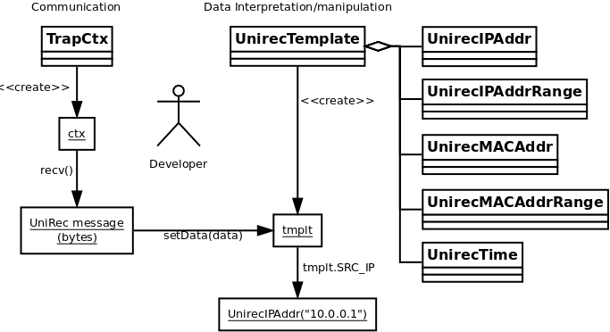

# Introduction



# Creation of image for containers

podman build -t pytrap-tutorial .

# Starting a container for experiment

```bash
podman run -ti pytrap-tutorial bash
```

# Running interactive python interpreter

```bash
ipython3
```

# Help

```python
import pytrap
help(pytrap)
help(pytrap.pytrap)
```

# Running example of UnirecTemplate

```python
fmttype = pytrap.FMT_UNIREC
fmtspec = "ipaddr SRC_IP,ipaddr DST_IP,uint16 SRC_PORT,uint16 DST_PORT,uint32 PACKETS,uint64 BYTES,string HOSTNAME"
rec = pytrap.UnirecTemplate(fmtspec)
rec.createMessage(1000)
rec.strRecord()
```

Further details in documentation
https://nemea.liberouter.org/doc/pytrap/
and examples at
https://github.com/CESNET/Nemea-Framework/tree/master/examples/python

